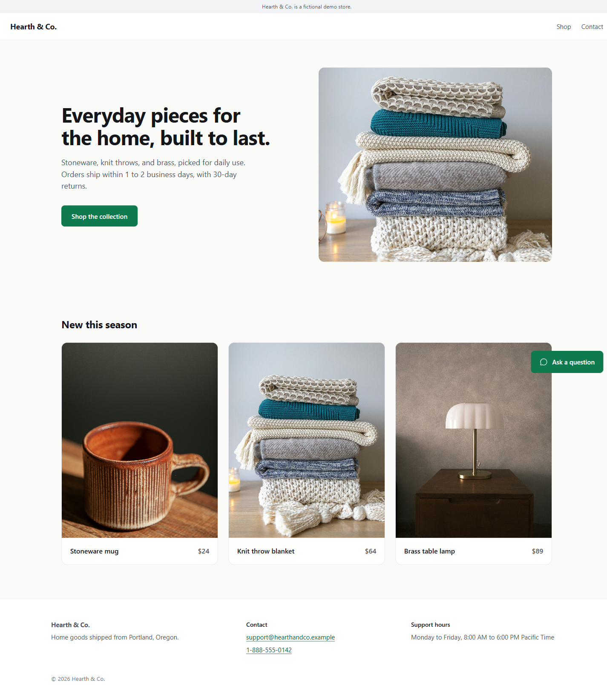
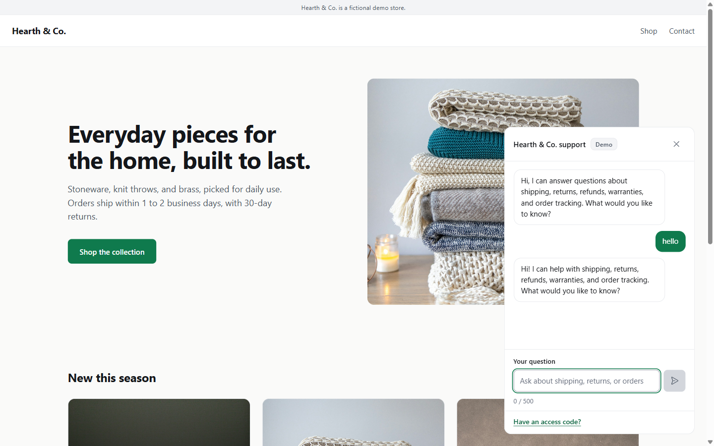

# AnswerDesk

AnswerDesk is a support chat for a fictional home-goods store, Hearth & Co. It answers
shoppers' policy questions (shipping, returns, refunds, warranty, tracking, payments) from the
store's policy document, names the section it used, and hands off to a human when the policy
does not cover the question.

Hearth & Co. is a fictional demo store. It is a portfolio project.





## How it works

- **Frontend:** Vite and React 18, plain CSS, one page with a chat widget in the corner.
- **Backend:** one Vercel serverless function, `api/chat.js`.
- **Policy source:** `docs/hearth-policies.md`, split by section.

### Demo mode and live mode

The server decides the mode for every request. The browser cannot choose it.

| | Demo mode (default) | Live mode |
|---|---|---|
| Used when | The access code is missing or wrong, or no API key is configured | A valid access code is sent **and** `ANTHROPIC_API_KEY` is set |
| What answers | Keyword scoring over the policy sections, returning the best section's first two sentences | Claude (`claude-haiku-4-5-20251001`), given the full policy text in its system prompt |
| Calls Claude | Never | Yes, once per question |
| Cost | Zero | Paid, billed to the owner's API account |

The widget shows a **Demo** or **Live** badge from the mode the server reports.

If a question is not covered by the policies, both modes answer with the same handoff
sentence: "I don't have that information. Would you like me to connect you with our team?"

Live mode is single-turn. The model receives only the system prompt and the current question.
A `history` field is still accepted for compatibility but is never sent to the model, because
client-supplied conversation turns could be forged to inject instructions.

## Security

**API key handling.** `ANTHROPIC_API_KEY` is read only inside the serverless function, from
`process.env`. It is never in frontend code, never in the built bundle, never committed, and
never returned in a response. Logs record only the error type on failure (never the message
or stack, because SDK errors can echo request details). Tests check that a key-containing SDK
error never reaches the HTTP response or the logs.

**Access-code gate.** Live mode requires both the access code and the key. The check runs on
the server: the code is compared with `ACCESS_CODE` using SHA-256 digests and
`crypto.timingSafeEqual`, so the comparison time does not depend on where the input differs.
If `ACCESS_CODE` is unset, live mode is never enabled. The visitor enters the code in a small
field in the widget. It is held in component state only. It is not written to `localStorage`,
`sessionStorage`, or the URL, and it clears on reload.

**Limits on every request.**
- Question: 500 characters maximum.
- Request body: 8 KB maximum.
- History field: at most 6 turns, validated, then ignored in live mode.
- Model output: `max_tokens` 300.
- Rate limit: 20 requests per minute per visitor. This is best-effort, see below.

**Rate limit caveat.** The limiter is in memory in each function instance. Serverless platforms
run several instances, and an instance can be recycled, so the limit is not airtight. It slows
down casual abuse on a warm instance. It is not a hard cap.

The visitor is identified by `x-vercel-forwarded-for`, then `x-real-ip`, which Vercel sets at its
edge. The client-supplied `x-forwarded-for` header is ignored, because a client can rotate it to
reset the limit. The function does not log visitor keys, so this has not been observed on a live
deployment. Before relying on the limit, temporarily log `req.headers['x-vercel-forwarded-for']`
on a preview deployment and confirm it holds a client IP, then remove the log.

**Prepaid ceiling.** The real cost ceiling is the API account's balance. Keep the prepaid
balance small, with auto-reload off. When the balance runs out, live requests fail and the
widget shows its "unavailable" message. No automatic top-up can raise the bill.

**Privacy.** No database. Conversations are not stored. Question text is not logged.

**Prompt-injection resistance.** The policy text is inside a `<policies>` tag in the system
prompt. Customer messages are sent as user-role text only, and the system prompt tells the
model to treat them as questions. The model's compliance with that instruction is a property of
the model, so it is tested with a mock, not proven. See `tests/chat.live.test.js`.

## Local setup

Requirements: Node 20.19 or newer (Node 20.16 works but prints engine warnings), npm, and a
Vercel account for the CLI login.

```bash
npm install
npx vercel login
npx vercel link
```

Start the app with the function running locally. In this Vercel CLI version, the function
reads environment variables from the shell that launches `vercel dev`, not from the project's
`.env.local`, so export them first:

PowerShell:

```powershell
$env:ANTHROPIC_API_KEY = "your-key"
$env:ACCESS_CODE = "a-long-random-string"
npx vercel dev --listen 3000
```

Bash:

```bash
export ANTHROPIC_API_KEY="your-key"
export ACCESS_CODE="a-long-random-string"
npx vercel dev --listen 3000
```

Leave `ANTHROPIC_API_KEY` unset to run demo mode only. Open http://localhost:3000.

### Tests

```bash
npm run test:unit          # pure functions and handler logic, no server
npm run test:live          # live mode against a mock Anthropic client, no network or key
npm run test:integration   # real HTTP against a running vercel dev on port 3000
```

Run `test:integration` while `vercel dev` is running.

## Deploy on Vercel

1. Push the repository to GitHub. Confirm `.env`, `.env.local`, and `.vercel/` are not in the
   commit. `.gitignore` covers them.
2. In the Vercel dashboard, choose **Add New > Project** and import the repository.
3. Framework preset: **Vite** (detected automatically). Build command: `npm run build`. Output
   directory: `dist`. Install command: `npm install`.
4. Open **Settings > Environment Variables** and add the two variables below, for the
   **Production** environment. Mark each one as **Sensitive** if the dashboard offers that
   option, so its value cannot be read back.
5. Click **Deploy**.
6. Open the deployed URL and ask a policy question in demo mode (no access code). A cited
   answer confirms that the function can read `docs/hearth-policies.md`. The repository's
   `vercel.json` includes that file in the function bundle. If the answer is a generic error
   instead, check that `vercel.json` was committed, then read the function logs in the Vercel
   dashboard.
7. Optional: enter the access code in the widget and ask a question. This calls Claude and
   costs money. Do it only after the prepaid balance is set.

### Environment variables to set in the Vercel dashboard

| Name | Value | Environments | Notes |
|---|---|---|---|
| `ANTHROPIC_API_KEY` | Your Anthropic API key | Production | Required for live mode. Leave unset to keep the site in demo mode only. |
| `ACCESS_CODE` | A long random string you choose | Production | Required for live mode. Share it only with people who should be able to use live mode. |

Do not set `VERCEL_OIDC_TOKEN` or any other variable by hand. Vercel manages those.

Make sure the Anthropic account has a small prepaid balance with auto-reload turned off before
you set `ANTHROPIC_API_KEY`.

## Project layout

```
api/chat.js                 the serverless function (validation, gate, demo, live)
docs/hearth-policies.md     the policy source, split into sections by ## headings
vercel.json                 bundles docs/hearth-policies.md with the function
src/                        React frontend (landing page and chat widget)
tests/                      unit, live (mocked), and integration tests
PRODUCT.md                  product and visual direction
CLAUDE.md                   project rules, including the security rules this README describes
```
